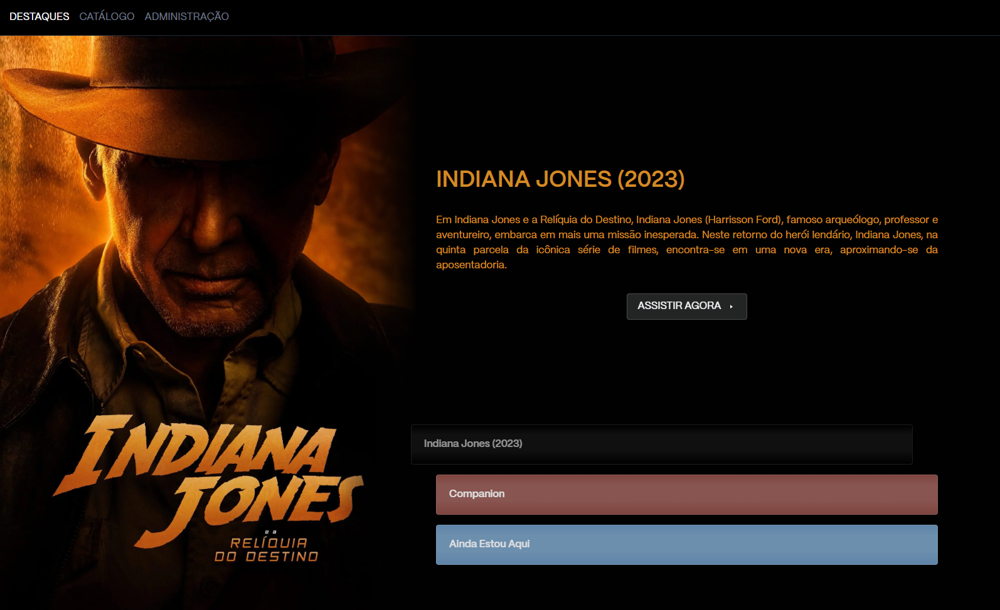

#  streaming-web 🎞

  

App para cadastro de vídeos disponíveis localmente para reproduzir na web em qualquer dispositivo conectado na mesma rede.
Usuários administradores tem controle de adicionar novos vídeos e alterar os vídeos em destaque.

#### Front-end

-  React

-  Typescript
          
-  Tailwind

-  Axios

#### Back-end
                    
-  Express
          
-  MySql
          
### Funcionalidades

- Assistir e navegar pelos diferentes vídeos cadastrados
- Administradores podem cadastrar, colocar como destaque e excluir vídeos 

